# Spatial Confetti 使用指南

> 适用于当前工作区 **0.1.0 + 独立速度色带 / 多形状纸片 / Duration API** · 中文图解 · 6 组可复制配方 · 真实 Flutter 动画素材

把一次成功反馈，从一个发射点，变成有方向、重量、风和形变的纸片与丝带。
本指南先给出能运行的动画，再逐项解释参数，最后说明调节顺序与诊断方法。

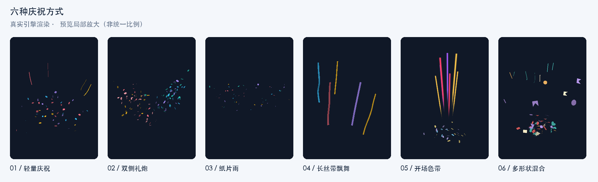

**阅读版本：**[离线图文版（含视频）](guide.html) · [完整 Dart 配方](presets.dart) · [可运行画廊](gallery.dart) · [最小接入示例](quick_start.dart)

这些效果由 `ConfettiSimulation + ConfettiPainter` 实际导出，固定种子、420 × 640 逻辑像素、24 帧/秒。视频展示实际计算的运动；原理图用于解释概念，不是仿真截图。视频帧率是导出采样率，不代表设备帧率测试结果。

当前所有粒子正反面统一使用配置原色，取消方向光照与背面压暗。现有截图、视频录制于这一着色调整之前，仍可用于观察运动；最新颜色表现可运行画廊查看。

## 阅读导航

1. [快速接入](#quick-start)
2. [六组动画预设](#presets)
3. [配置结构与单位](#structure)
4. [发射器与随机组合](#emitter)
5. [纸片与彩带材料](#particles)
6. [风场与阵风](#wind)
7. [独立速度色带](#streak)
8. [相机与坐标转换](#camera)
9. [宿主、播放控制与生命周期](#host)
10. [资源预算、统计与排错](#diagnostics)
11. [复现素材与验证范围](#evidence)

<a id="quick-start"></a>
## 1. 快速接入

### 1.1 依赖与运行条件

需要 Flutter **3.44.6 或更新**、Dart **≥ 3.12.2 且 < 4.0.0**。首次发布到 pub.dev 后，应用可使用对应已发布版本，例如 `^0.1.0`。发布前，本仓库的独立 `example/pubspec.yaml` 使用本地源码：

```yaml
dependencies:
  flutter:
    sdk: flutter
  spatial_confetti:
    path: ..
```

```dart
import 'package:spatial_confetti/spatial_confetti.dart';
```

本指南的 `GuidePresets` 是可复制的文档示例类，**不是插件导出的内置类**；将 `presets.dart` 放进自己的项目并导入它。

### 1.2 一次性反馈：Confetti.launch

按钮触发时创建临时 Overlay，播放结束自动回收。下面的完整文件可直接运行；其中 `presets.dart` 与它放在同一目录。

```dart
import 'package:flutter/material.dart';
import 'package:spatial_confetti/spatial_confetti.dart';
import 'presets.dart';

/// 从 example 目录运行 flutter run -t ../doc/quick_start.dart。
void main() => runApp(const MaterialApp(home: QuickStart()));

/// 按钮触发一次自动清理的覆盖层动画。
class QuickStart extends StatelessWidget {
  const QuickStart({super.key});

  void _celebrate(BuildContext context) {
    const camera = ConfettiCamera(viewHeight: 6.5);
    // 使用最近 Overlay 的实际绘制区域，不假设它等于整块屏幕。
    final overlay = Overlay.of(context);
    final box = overlay.context.findRenderObject()! as RenderBox;
    final origin = camera.unproject(
      Offset(box.size.width * .5, box.size.height * .87),
      box.size,
    );
    Confetti.launch(
      context,
      effect: GuidePresets.celebration(origin),
      camera: camera,
      gravity: const Vec3(0, 9.81, 0),
      wind: WindField(),
      limits: const ConfettiLimits(),
      respectReducedMotion: true,
    );
  }

  @override
  Widget build(BuildContext context) => Scaffold(
    appBar: AppBar(title: const Text('Confetti 快速开始')),
    body: Center(
      child: FilledButton(
        onPressed: () => _celebrate(context),
        child: const Text('完成，庆祝一下'),
      ),
    ),
  );
}
```

同一个 Overlay 上再次调用 `launch` 会替换上一次动画。希望多次播放叠加，或者实时修改风场，应使用下面的控制器宿主。

### 1.3 持续控制：ConfettiController + ConfettiView

```dart
// 在 State 的字段或 initState 中创建，由这个 State 在 dispose 中释放。
final controller = ConfettiController(
  gravity: const Vec3(0, 9.81, 0),
  wind: WindField(),
  limits: const ConfettiLimits(),
);

// 放在有有限尺寸的 Stack 中；交互按钮放在同级。
Positioned.fill(
  child: ConfettiView(
    controller: controller,
    camera: const ConfettiCamera(viewHeight: 6.5),
    showNodes: false,
    respectReducedMotion: true,
  ),
);

// origin 是用同一个 camera、同一绘制区域反投影得到的世界位置。
final playback = controller.emit(GuidePresets.celebration(origin));
// 用户主动结束持续发射时，再调用：playback.stopEmission();
// 它只停止本次后续出生，已有粒子继续飞行。
// State.dispose 中：controller.dispose();
```

此段用于解释接入位置；完整生命周期与按钮操作见 [gallery.dart](gallery.dart)。`ConfettiView.child` 也会忽略触摸，不要把需要点击的业务按钮放进它。

在本仓库运行这份指南的交互画廊：

```bash
cd packages/spatial_confetti/example
flutter pub get
flutter run -t ../doc/gallery.dart
# 最小 Overlay 示例：flutter run -t ../doc/quick_start.dart
```

画廊可选择六个场景、重播、暂停/继续，并吹入一次局部阵风。重播会新建时钟和初始风场，保证同种子比较的条件相同。

<a id="presets"></a>
## 2. 六组动画预设

所有预设使用正常向下重力 `Vec3(0, 9.81, 0)`，相机 `viewHeight: 6.5, distance: 10, near: .25, far: 60`，默认 `ConfettiLimits()`。风场属于宿主，不藏在 `ConfettiEffect` 中。完整的环境组合见 `presets.dart` 的 `guideScenes(size)`。

| 预设 | 出生配置 | 重点 | 基础风环境 |
| --- | --- | --- | --- |
| 轻量庆祝 | 48 纸片 + 4 短丝带 | 适合作为成功反馈的起始配方 | 静止空气 |
| 双侧礼炮 | 左右各 60 纸片，右侧延迟 0.12 s | 两股朝内发射，颜色分组 | 全局 `(0.3, 0, 0.15)` m/s，涡流 0.1 |
| 纸片雨 | 6 路 × 7 个/s × 2.5 s | 从顶部铺开，缓慢出生 | 全局 `(0.45, 0, 0.2)` m/s，涡流 0.2 |
| 长丝带飘舞 | 5 条，长度 0.9–1.4 m，18 段 | 观察自由飞行与材料截面变化 | 全局 `(0.8, −0.15, 0.45)` m/s，涡流 0.35 |
| 开场速度色带 | 28 纸片 + 7 独立色带 | 色带 260 ms 内展开收回，纸片继续飞行 | 静止空气 |
| 多形状随机混合 | 共 56 个，六种纸片与丝带按权重抽取 | 纸片各权重 2，丝带权重 1 | 全局 `(0.35, 0, 0.2)` m/s，涡流 0.12 |

**纸片雨为何是 102 个？** 每路实际累计 `floor(7 × 2.5) = 17` 个，六路共 102 个，而不是把六路的总速率先合并再向下取整。出生时间还会量化到 1/120 秒的模拟边界。

### 2.1 轻量庆祝

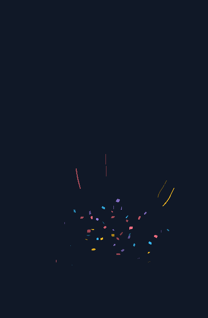

<figure class="motion"><video controls playsinline preload="none" poster="assets/celebration.png" aria-label="轻量庆祝真实渲染动画"><source src="assets/celebration.mp4" type="video/mp4"/><a href="assets/celebration.mp4">播放轻量庆祝</a></video><figcaption>轻量庆祝 · 当前 Flutter 引擎实际渲染 · 可暂停逐段观察</figcaption></figure>

起点在画布下方 87% 高度处。纸片和丝带使用两个发射器，保证数量分别为 48 和 4；这与随机选中某个类型的权重不同。丝带延迟 0.04 s，形成轻微层次。这里“轻量”指这组配方的数量相对克制，不代表已经通过所有设备的性能测试。

先调 `burstCount` 控制密度，再调 `speed` 与 `spread` 控制展开范围；想保留短促反馈，可缩短 `lifetime`。纸片始终保留材料本体的三维翻转。

<details>
<summary>展开完整 celebration 配置（复制到自己的配方类）</summary>

```dart
  static ConfettiEffect celebration(Vec3 origin) => ConfettiEffect(
    seed: 17,
    emitters: [
      ConfettiEmitter.burst(
        origin: origin,
        direction: const Vec3(0, -1, 0),
        speed: const NumberRange(7, 10),
        spread: .65,
        radius: .04,
        lifetime: const ParticleLifetime(
          duration: DurationRange(Duration(milliseconds: 2400), Duration(milliseconds: 3400)),
        ),
        delay: Duration.zero,
        burstCount: 48,
        particles: [
          ParticleChoice(
            weight: 1,
            colors: const [
              Color(0xfffb7185),
              Color(0xfffbbf24),
              Color(0xff38bdf8),
              Color(0xffa78bfa),
            ],
            particle: const PaperParticle.noBend(
              size: PaperSize.stretched(
                width: NumberRange(.035, .065),
                height: NumberRange(.045, .085),
              ),
              massPerArea: .16,
              dragCoefficient: .35,
              angularSpeed: NumberRange(-7, 7),
            ),
          ),
        ],
      ),
      ConfettiEmitter.burst(
        origin: origin,
        direction: const Vec3(0, -1, 0),
        speed: const NumberRange(7, 9),
        spread: .55,
        radius: .02,
        lifetime: const ParticleLifetime(
          duration: DurationRange(Duration(milliseconds: 2500), Duration(milliseconds: 3500)),
        ),
        delay: const Duration(milliseconds: 40),
        burstCount: 4,
        particles: [
          ParticleChoice(
            weight: 1,
            colors: const [Color(0xfffbbf24), Color(0xff38bdf8), Color(0xfffb7185)],
            particle: const RibbonParticle(
              width: NumberRange(.025, .04),
              length: NumberRange(.3, .5),
              segments: 10,
              massPerArea: .12,
              dragCoefficient: .6,
              surfaceFriction: .015,
              bendingStiffness: .000002,
              inPlaneBendingStiffness: .0002,
              torsionalStiffness: .000001,
              thickness: .00005,
              damping: 1.5,
              angularSpeed: NumberRange(-2, 2),
            ),
          ),
        ],
      ),
    ],
  );
```

</details>

### 2.2 双侧礼炮


<figure class="motion"><video controls playsinline preload="none" poster="assets/side-cannons.png" aria-label="双侧礼炮真实渲染动画"><source src="assets/side-cannons.mp4" type="video/mp4"/><a href="assets/side-cannons.mp4">播放双侧礼炮</a></video><figcaption>双侧礼炮 · 当前 Flutter 引擎实际渲染 · 可暂停逐段观察</figcaption></figure>

两端分别位于画布宽度的 7% 与 93%，高度为 87%。方向的 X 分量分别为正和负，Y 都为负；向量会归一化，**增大 direction 的长度不会提高速度**。深度方向的小差异让两股纸片的投影略有区别。

左右颜色分别写在各自的 `ParticleChoice.colors` 中。要降低开场密度，分别减少两个发射器的 `burstCount`；要展开得更宽，先增加 `spread`，再观察是否太早离开画布。

<details>
<summary>展开完整 sideCannons 配置（复制到自己的配方类）</summary>

```dart
  static ConfettiEffect sideCannons({required Vec3 left, required Vec3 right}) => ConfettiEffect(
    seed: 41,
    emitters: [
      ConfettiEmitter.burst(
        origin: left,
        direction: const Vec3(.8, -1, .08),
        speed: const NumberRange(8, 12),
        spread: .35,
        radius: .03,
        lifetime: const ParticleLifetime(
          duration: DurationRange(Duration(seconds: 3), Duration(seconds: 4)),
        ),
        delay: Duration.zero,
        burstCount: 60,
        particles: [
          ParticleChoice(
            weight: 1,
            colors: const [Color(0xfffbbf24), Color(0xfffb7185), Color(0xfffda4af)],
            particle: const PaperParticle.noBend(
              size: PaperSize.stretched(
                width: NumberRange(.035, .07),
                height: NumberRange(.055, .1),
              ),
              massPerArea: .16,
              dragCoefficient: .35,
              angularSpeed: NumberRange(-9, 9),
            ),
          ),
        ],
      ),
      ConfettiEmitter.burst(
        origin: right,
        direction: const Vec3(-.8, -1, -.08),
        speed: const NumberRange(8, 12),
        spread: .35,
        radius: .03,
        lifetime: const ParticleLifetime(
          duration: DurationRange(Duration(seconds: 3), Duration(seconds: 4)),
        ),
        delay: const Duration(milliseconds: 120),
        burstCount: 60,
        particles: [
          ParticleChoice(
            weight: 1,
            colors: const [Color(0xff38bdf8), Color(0xffa78bfa), Color(0xff2dd4bf)],
            particle: const PaperParticle.noBend(
              size: PaperSize.stretched(
                width: NumberRange(.035, .07),
                height: NumberRange(.055, .1),
              ),
              massPerArea: .16,
              dragCoefficient: .35,
              angularSpeed: NumberRange(-9, 9),
            ),
          ),
        ],
      ),
    ],
  );
```

</details>

### 2.3 纸片雨


<figure class="motion"><video controls playsinline preload="none" poster="assets/paper-rain.png" aria-label="纸片雨真实渲染动画"><source src="assets/paper-rain.mp4" type="video/mp4"/><a href="assets/paper-rain.mp4">播放纸片雨</a></video><figcaption>纸片雨 · 当前 Flutter 引擎实际渲染 · 可暂停逐段观察</figcaption></figure>

六个起点覆盖顶部宽度。每个发射器的 `radius: .1` 只用于轻微扰动；大的 `radius` 会在 XYZ 球体内散布，不能当作“只有水平方向的范围”。逐列 0.04 s 的延迟使开始时间略有错落。

增加 `rate` 会更密，增加 `duration` 会下得更久；两者都可能增加同时存活数量。提高 `dragCoefficient` 通常增强空气对纸片平移的约束，实际下落还取决于姿态、面密度与风。

<details>
<summary>展开完整 paperRain 配置（复制到自己的配方类）</summary>

```dart
  static ConfettiEffect paperRain({required double halfWidth, required double top}) =>
      ConfettiEffect(
        seed: 73,
        emitters: [
          for (var column = 0; column < 6; column++)
            ConfettiEmitter.stream(
              origin: Vec3(-halfWidth + 2 * halfWidth * (column + .5) / 6, top, 0),
              direction: const Vec3(0, 1, 0),
              speed: const NumberRange(.3, 1),
              spread: .35,
              radius: .1,
              lifetime: const ParticleLifetime(
                duration: DurationRange(Duration(seconds: 3), Duration(milliseconds: 4500)),
              ),
              delay: Duration(milliseconds: column * 40),
              burstCount: 0,
              rate: 7,
              duration: const Duration(milliseconds: 2500),
              particles: [
                ParticleChoice(
                  weight: 1,
                  colors: const [
                    Color(0xfffbbf24),
                    Color(0xff38bdf8),
                    Color(0xfffb7185),
                    Color(0xffa78bfa),
                    Color(0xff2dd4bf),
                  ],
                  particle: const PaperParticle.noBend(
                    size: PaperSize.stretched(
                      width: NumberRange(.035, .07),
                      height: NumberRange(.045, .09),
                    ),
                    massPerArea: .08,
                    dragCoefficient: 1.15,
                    angularSpeed: NumberRange(-4, 4),
                  ),
                ),
              ],
            ),
        ],
      );
```

</details>

### 2.4 长丝带飘舞

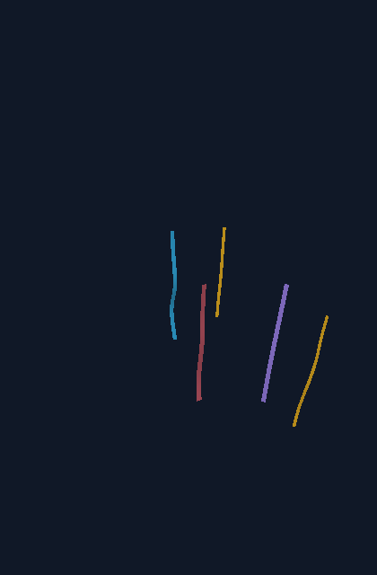

<figure class="motion"><video controls playsinline preload="none" poster="assets/ribbon-dance.png" aria-label="长丝带飘舞真实渲染动画"><source src="assets/ribbon-dance.mp4" type="video/mp4"/><a href="assets/ribbon-dance.mp4">播放长丝带飘舞</a></video><figcaption>长丝带飘舞 · 当前 Flutter 引擎实际渲染 · 可暂停逐段观察</figcaption></figure>

每条丝带在出生时已经具有完整长度，前端在发射起点，其余材料向后展开。它不是逐渐“长出来”的线条，也没有主动把受力点从头端移到尾端的控制器。

本配方单独观察柔性材料。`segments: 18` 是物理分段；渲染会在段间做曲线采样。提高段数不能替代合适的材料刚度，而且会增加计算成本。当前模型与默认材料参数没有经过实物标定，视频展示的是当前实现的真实结果。

<details>
<summary>展开完整 ribbonDance 配置（复制到自己的配方类）</summary>

```dart
  static ConfettiEffect ribbonDance(Vec3 origin) => ConfettiEffect(
    seed: 29,
    emitters: [
      ConfettiEmitter.burst(
        origin: origin,
        direction: const Vec3(0, -1, 0),
        speed: const NumberRange(7, 9),
        spread: .4,
        radius: .12,
        lifetime: const ParticleLifetime(
          duration: DurationRange(Duration(milliseconds: 3500), Duration(milliseconds: 4500)),
        ),
        delay: Duration.zero,
        burstCount: 5,
        particles: [
          ParticleChoice(
            weight: 1,
            colors: const [
              Color(0xfffb7185),
              Color(0xfffbbf24),
              Color(0xff38bdf8),
              Color(0xffa78bfa),
            ],
            particle: const RibbonParticle(
              width: NumberRange(.035, .055),
              length: NumberRange(.9, 1.4),
              segments: 18,
              massPerArea: .12,
              dragCoefficient: .6,
              surfaceFriction: .012,
              bendingStiffness: .000002,
              inPlaneBendingStiffness: .0002,
              torsionalStiffness: .000001,
              thickness: .00005,
              damping: 1.5,
              angularSpeed: NumberRange(-3, 3),
            ),
          ),
        ],
      ),
    ],
  );
```

</details>

### 2.5 开场速度色带

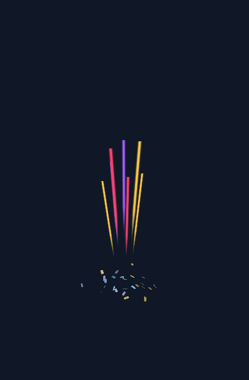

<figure class="motion"><video controls playsinline preload="none" poster="assets/streak-burst.png" aria-label="开场速度色带真实渲染动画"><source src="assets/streak-burst.mp4" type="video/mp4"/><a href="assets/streak-burst.mp4">播放开场速度色带</a></video><figcaption>开场速度色带 · 当前 Flutter 引擎实际渲染 · 可暂停逐段观察</figcaption></figure>

这组配方将 7 条短寿命速度色带与 28 张纸片同时发射。色带的实色主干在开场展开，再随独立长度包络收回，260 ms 寿命结束后回收（按固定模拟步生效）；普通纸片继续运动。它不使用纸片或丝带的历史路径。

<details>
<summary>展开完整 streakBurst 配置（复制到自己的配方类）</summary>

```dart
  static ConfettiEffect streakBurst(Vec3 origin) => ConfettiEffect(
    seed: 97,
    emitters: [
      ConfettiEmitter.burst(
        origin: origin,
        direction: const Vec3(0, -1, 0),
        speed: const NumberRange(9, 13),
        spread: .6,
        radius: .06,
        lifetime: const ParticleLifetime(
          duration: DurationRange(Duration(milliseconds: 2500), Duration(milliseconds: 3500)),
        ),
        delay: Duration.zero,
        burstCount: 28,
        particles: [
          ParticleChoice(
            weight: 1,
            colors: const [Color(0xff7dd3fc), Color(0xffc4b5fd), Color(0xfffde68a)],
            particle: const PaperParticle.noBend(
              size: PaperSize.stretched(
                width: NumberRange(.035, .055),
                height: NumberRange(.065, .095),
              ),
              massPerArea: .16,
              dragCoefficient: .3,
              angularSpeed: NumberRange(-2, 2),
            ),
          ),
        ],
      ),
      ConfettiEmitter.burst(
        origin: origin,
        direction: const Vec3(0, -1, .08),
        speed: const NumberRange(22, 30),
        spread: .24,
        burstCount: 7,
        lifetime: const ParticleLifetime(
          duration: DurationRange.fixed(Duration(milliseconds: 260)),
          fadeOut: Duration(milliseconds: 100),
        ),
        particles: [
          ParticleChoice(
            particle: const StreakParticle(),
            colors: const [Color(0xffffc84a), Color(0xffff416c), Color(0xffa65cff)],
          ),
        ],
      ),
    ],
  );
```

</details>

### 2.6 多形状随机混合

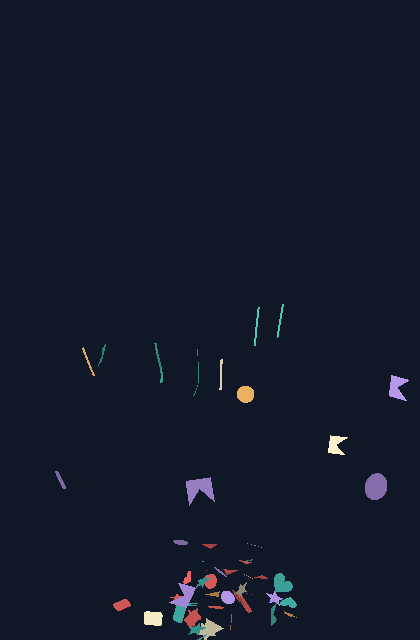

<figure class="motion"><video controls playsinline preload="none" poster="assets/shape-mix.png" aria-label="多形状随机混合真实渲染动画"><source src="assets/shape-mix.mp4" type="video/mp4"/><a href="assets/shape-mix.mp4">播放多形状随机混合</a></video><figcaption>多形状随机混合 · 当前 Flutter 引擎实际渲染 · 可暂停逐段观察</figcaption></figure>

同一个 particles 列表中放六种 PaperParticle 与 RibbonParticle。每种纸片被选中的概率为 2/13，丝带为 1/13；56 是总计划数量，不保证每种的固定数量。每次出生还会独立采样尺寸、颜色、初始角速度和发射器运动参数。形状与材料、颜色需要关联时，把它们写在同一个 ParticleChoice 中。无需 randomShapes 或第二套选择器。

<details>
<summary>展开完整 shapeMix 配置（复制到自己的配方类）</summary>

```dart
  static ConfettiEffect shapeMix(Vec3 origin) => ConfettiEffect(
    seed: 61,
    emitters: [
      ConfettiEmitter.burst(
        origin: origin,
        direction: const Vec3(0, -1, .1),
        speed: const NumberRange(7, 10),
        spread: .48,
        burstCount: 56,
        lifetime: const ParticleLifetime(
          duration: DurationRange(Duration(seconds: 3), Duration(seconds: 4)),
        ),
        particles: [
          for (final shape in [
            const PaperShape.rectangle(aspectRatio: .7),
            const PaperShape.circle(),
            const PaperShape.triangle(),
            const PaperShape.star(points: 5, innerRadiusRatio: .45),
            const PaperShape.heart(),
            PaperShape.polygon(
              vertices: const [
                Offset(0, 0),
                Offset(1, 0),
                Offset(.4, .5),
                Offset(1, 1),
                Offset(0, 1),
              ],
            ),
          ])
            ParticleChoice(
              weight: 2,
              particle: PaperParticle.noBend(
                shape: shape,
                size: const PaperSize.proportional(NumberRange(.15, .23)),
                massPerArea: .12,
                dragCoefficient: .65,
                surfaceFriction: .02,
                angularSpeed: const NumberRange(-4, 4),
              ),
            ),
          ParticleChoice(
            weight: 1,
            particle: const RibbonParticle(
              width: NumberRange(.018, .025),
              length: NumberRange(.3, .5),
              segments: 10,
            ),
          ),
        ],
      ),
    ],
  );
```

</details>

<a id="structure"></a>
## 3. 配置结构与单位

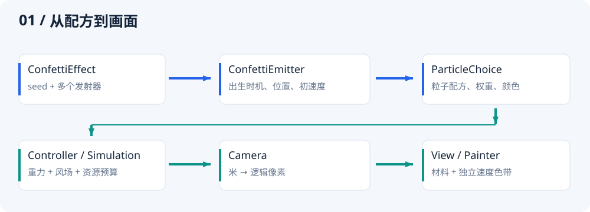

- **配方层**：`ConfettiEffect → ConfettiEmitter → ParticleChoice → PaperParticle / RibbonParticle`。
- **环境层**：`gravity`、`WindField`、`WindGust` 和 `ConfettiLimits` 由模拟器/控制器拥有。
- **呈现层**：`ConfettiCamera` 管投影，`ConfettiView` 管时钟与生命周期，`ConfettiPainter` 管绘制。

创建配方后，改变外部列表不会改变它；列表在相关构造中复制为不可修改列表。粒子的随机尺寸、初始速度、颜色等在出生时确定；改成一份新配方，只会影响下一次出生。风和重力可以实时影响已有粒子。

### 3.1 单位速查

| 单位 | 使用位置 | 例子 |
| --- | --- | --- |
| 米 m | 世界位置、粒子宽高/长度、厚度、发射半径、风半径、相机距离 | `.05` m = 5 cm；`.00005` m = 0.05 mm |
| Duration | delay、duration、fadeIn、fadeOut、过渡时长、模拟时间 | `Duration(milliseconds: 250)`；lifetime 配置为 ParticleLifetime，其 duration 使用 DurationRange |
| 米/秒 m/s | speed、WindSource.velocity、WindGust.velocity、turbulence | `Vec3(2,0,0)` 表示向右 2 m/s 的空气速度 |
| 米/秒² m/s² | gravity | 默认 `Vec3(0,9.81,0)` 向下 |
| 弧度 rad | spread、phase、旋转角 | π/6 ≈ 0.524 rad = 30° |
| 弧度/秒 rad/s | angularSpeed | 2π rad/s = 每秒一圈 |
| 千克/米² kg/m² | massPerArea | `.08` = 80 g/m² |
| 牛顿·米 N·m | PaperParticle.bend.bendingStiffness | 纸面的抗弯刚度 |
| 牛顿·米² N·m² | Ribbon 的三种弯曲/扭转刚度 | 不能把它们当作 0–1 的动画插值系数 |
| 1/秒 s⁻¹ | damping、airResistance | 内部形变速度的耗散率 |
| 1/米 m⁻¹ | spatialScale | 数值大表示空间变化更密，不是更大的风半径 |
| 逻辑像素 px | 投影坐标、自动柔边 | 与设备物理像素不同，不手动乘 DPR |
| 逻辑像素/秒 px/s | 光迹判断使用的投影速度 | 内部按画布高度归一化，等比缩放画布不改变门限 |
| 无量纲 | dragCoefficient、surfaceFriction、weight、variation | 各参数范围与语义不同，不互相换算 |

### 3.2 Vec3

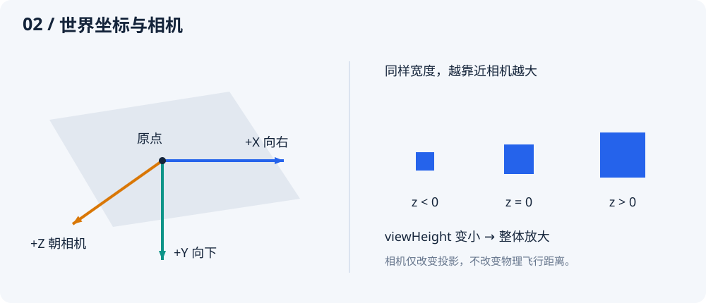

`Vec3(x, y, z)` 的 **X 向右、Y 向下、Z 朝相机**；因此向上是 `Vec3(0, -1, 0)`。正负深度表示前后，不是图层编号。向量构造本身不校验，配置入口通常要求分量有限、模长不超过 10000；发射方向还要求非零。

| 成员/参数 | 说明 |
| --- | --- |
| `x / y / z` | 单位由用途决定；同一类型可以表达位置、速度或方向 |
| `zero / right / down / forward` | 分别是零向量、+X、+Y、+Z 单位向量 |
| `+ / - / unary - / * value / / value` | 向量运算；除法调用者保证除数非零且有限 |
| `dot(other) / cross(other)` | 点积投影与叉积方向，适合几何运算 |
| `length / lengthSquared / isFinite` | 模长、模长平方、是否有限 |
| `normalized([fallback = Vec3.right])` | 返回单位向量；极小向量返回 fallback，fallback 不会再次归一化 |
| `limited(maximum)` | 限制模长，保持方向；maximum 由调用者保证非负有限 |
| `lerp(other, fraction)` | 线性插值，不自动将 fraction 截断到 0–1 |
| `rotated(axis, angle)` | axis 必须是单位轴；angle 为弧度 |
| `== / hashCode / toString()` | 精确分量比较、哈希与调试文本；相等比较不带误差容限 |

### 3.3 NumberRange

`NumberRange(minimum, maximum)` 表示均匀随机范围；`NumberRange.fixed(value)` 表示固定值。单位由外层参数决定；它只用于数值物理量，不再用于寿命。

```dart
speed: const NumberRange(7, 10),          // 每个粒子采样 7–10 m/s
length: const NumberRange.fixed(1.2),     // 所有丝带都是 1.2 m
angularSpeed: const NumberRange(-3, 3),   // 正反转向都可能出现
```

`minimum ≤ maximum`，且两端必须有限并符合具体参数范围。非固定范围按随机数的左闭右开区间采样；不要依赖恰好抽到最大值。`sample(Random random)` 接收调用方随机源，普通接入无需手工调用。`const` 构造不立即校验，配方加入 `ParticleChoice` 或 `ConfettiEmitter` 时才校验。

### 3.4 Duration 与 DurationRange

所有表示时长和相对时间的公开值使用 **Duration**。可以自由选秒、毫秒或微秒：`Duration(seconds: 2)`、`Duration(milliseconds: 420)`、`Duration(microseconds: 250)`；零时长使用 `Duration.zero`。速度、频率和阻尼不是时长，仍使用数值。

生命周期使用 **ParticleLifetime** 分组，其中随机时长使用与 NumberRange 对应的 **DurationRange**：

```dart
lifetime: const ParticleLifetime(duration: DurationRange(
  Duration(milliseconds: 1500),
  Duration(seconds: 3),
)),
// 固定寿命：
lifetime: const ParticleLifetime(duration: DurationRange.fixed(Duration(seconds: 2))),
```

| 成员 | 含义 |
| --- | --- |
| `minimum / maximum` | Duration 端点，minimum ≤ maximum；发射器要求两端处于 20 ms～60 s |
| `DurationRange(minimum, maximum)` | 声明随机时长范围，支持 const；构造发射器时校验寿命边界 |
| `DurationRange.fixed(value)` | 固定时长，仍支持 const |
| `sample(Random random)` | 返回 Duration；非固定范围以整数微秒在左闭右开区间均匀采样；每次消耗一个 nextDouble，包括固定范围 |

Duration 不表示日期。`simulation.time`、粒子 `age` 和风场采样时间都是模拟中的相对时间。读取为带小数的秒时，用 `value.inMicroseconds / Duration.microsecondsPerSecond`；`inSeconds` 会截去小数部分。

从旧版迁移：

| 旧写法（double 秒） | 当前写法 |
| --- | --- |
| `duration: .24` | `duration: const Duration(milliseconds: 240)` |
| `delay: 0` | `delay: Duration.zero` |
| `transition: .3` | `transition: const Duration(milliseconds: 300)` |
| `lifetime: NumberRange(3, 5)` | `lifetime: const ParticleLifetime(duration: DurationRange(Duration(seconds: 3), Duration(seconds: 5)))` |
| `simulation.advance(.1)` | `simulation.advance(const Duration(milliseconds: 100))` |
| `wind.velocityAt(point, 2)` | `wind.velocityAt(point, const Duration(seconds: 2))` |

随机寿命由连续秒数改为整数微秒，可能产生不到 1 微秒的量化差异；因此极靠近寿命边界的跨版本比较不保证逐帧完全相同。固定物理步与材料算法保持原定义。

<a id="emitter"></a>
## 4. 发射器与随机组合

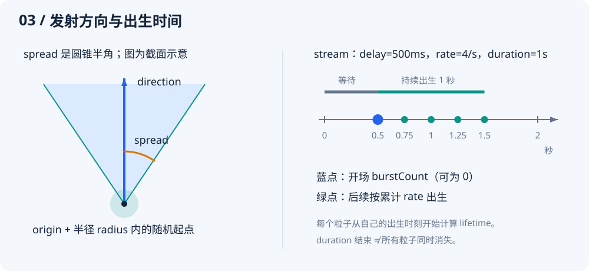

### 4.1 ConfettiEffect

| 参数 | 默认/范围 | 作用与调节 |
| --- | --- | --- |
| `emitters` | 必填，1–32 个 | 一次播放组合多个发射源。可通过不同位置、颜色、延迟和材料形成层次；同时到期时按列表顺序消耗预算 |
| `seed` | `1`，int | 决定出生的随机序列。固定它便于比较参数；变化它获得不同图案。不能保证跨 SDK/插件版本逐帧相同 |

固定 seed 还不够：风的初始条件、`WindField.seed`、模拟时间、播放顺序与资源预算也应相同。`clear()` 保留时间，想从零复现请新建控制器或模拟器。

### 4.2 ConfettiEmitter 的两种构造

`ConfettiEmitter.burst(...)` 一次批量出生；`ConfettiEmitter.stream(...)` 持续出生，可带开场批次。两者采用同一种自由飞行模型，**没有终点、路径 Curve、停留终点或独立的喷射轨迹模式**。

| 参数 | 默认值 | 单位 / 范围 | 作用与调节 |
| --- | --- | --- | --- |
| `particles` | 必填 | 1–64 个候选 | 按权重选择配方与颜色组；列表内可以同时包含纸片与丝带 |
| `origin` | `Vec3.zero` | m；有限向量、模长 ≤ 10000 | 发射中心。实际出生点还加 radius 扰动；应使用相机反投影定位按钮或画布边缘 |
| `direction` | `(0,-1,0)` | 非零向量、模长 ≤ 10000 | 发射圆锥中心轴。内部归一化；改变模长不能增加初速 |
| `speed` | `NumberRange(5,9)` | m/s；两端 0–100 | 每个粒子的初始速率。越大通常初期更快、更远，但也可能增强空气阻力并更早离屏 |
| `spread` | `.45`（约 25.8°） | rad；0–π | 圆锥半角，按立体角均匀采样。0 固定方向，π/2 半球，π 整个球面；大值使“向上”粒子也可能向侧方或下方 |
| `radius` | `0` | m；0–10 | 按球体体积均匀采样出生位置。影响 XYZ，不是屏幕圆周；0 精确从 origin 出生 |
| `lifetime` | `const ParticleLifetime()` | ParticleLifetime | 分组声明随机寿命和 fadeIn/fadeOut；时长均从各自出生起算。加长寿命增加保留资源时间 |
| `delay` | `Duration.zero` | Duration；0～120 s | 相对本次效果开始的等待；不属于粒子的寿命 |
| `burstCount` | burst 必填；stream 默认 `0` | burst 1–10000；stream 0–10000 | delay 到期时一次出生数量。stream 的开场批次与后续出生属于同一个发射器和随机流 |
| `rate` | stream 必填 | 个/s；>0 且 ≤2000 | 持续出生速率，以累计数量向下取整。burst 构造不接受，内部只读值为 0 |
| `duration` | stream 必填 | Duration；10 ms～120 s | 持续出生阶段的长度，不含 delay；不决定已有粒子的结束时刻。burst 不接受，内部为 Duration.zero |

单发射器的计划出生总数为 `burstCount + floor(rate × durationSeconds)`（burst 的 rate 为 0），其中 durationSeconds 是 duration 转为秒后的数值，实际仍受资源预算限制。调度对浮点数边界做了小容差处理，出生量化到首个不早于计划时刻的固定模拟步。

### 4.3 ParticleLifetime：寿命、淡入与淡出

```dart
lifetime: const ParticleLifetime(
  duration: DurationRange(Duration(seconds: 3), Duration(seconds: 5)),
  fadeIn: Duration(milliseconds: 200),
  fadeOut: Duration(milliseconds: 600),
),
```

| 参数 | 默认值 | 范围与作用 |
| --- | --- | --- |
| `duration` | `DurationRange(Duration(seconds: 3), Duration(seconds: 5))` | 寿命随机范围，两端 20 ms～60 s；每个粒子出生时采样一次，包含淡入与淡出 |
| `fadeIn` | `Duration.zero` | 0～60 s；出生后从透明线性增加到原色 alpha；0 表示立即显示 |
| `fadeOut` | `Duration(milliseconds: 350)` | 0～60 s；寿命结束前从原色 alpha 线性降到透明；0 表示到期直接隐藏本体 |

例如实际寿命为 3 秒、淡入 200 ms、淡出 600 ms：0～200 ms 淡入，200～2400 ms 保持，2400～3000 ms 淡出。淡入淡出不额外延长寿命。

如果两窗口之和超过实际采样寿命，按同一比例缩短。比如寿命 600 ms、淡入 1 s、淡出 2 s，实际使用 200 ms 和 400 ms，透明度先到达原色 alpha，再降到零。原配置值不会被改写，随机寿命较短的粒子分别计算自己的比例。

所有粒子共用该规则，按各自出生时刻计算淡入淡出；透明度乘原色 alpha，寿命结束即释放。光迹另有长度展开/收回包络，仍包含在同一寿命内。

修改配方只影响随后出生的粒子。示例提供毫秒单位的“淡入”“淡出”滑块，作用于批量、持续发射与单粒子观察。过渡使用同一模拟时钟，暂停时同步暂停。

迁移：`lifetime: range` 改为 `lifetime: ParticleLifetime(duration: range)`；读取范围改为 `emitter.lifetime.duration.minimum/maximum`。粒子快照的 `lifetime` 仍是实际采样的 Duration。本体不再使用旧的 `min(350 ms, 寿命/4)` 隐式窗口，短寿命默认淡出的观感会变化；需要无过渡时将 fadeIn/fadeOut 都设为 Duration.zero。

### 4.4 ParticleChoice

| 参数 | 默认/范围 | 作用与调节 |
| --- | --- | --- |
| `particle` | 必填 | `PaperParticle` 或 `RibbonParticle` 的完整配方；构造 choice 时执行材料参数校验 |
| `weight` | `1`；0.0001–10000 | 相对权重，概率 = 自己的 weight / 同一发射器所有权重之和。不是固定数量，也不是百分比字段 |
| `colors` | 五色默认列表；1–64 色 | 选中本条目后，在颜色列表中等概率选一个；所有粒子正反面使用原色，朝向不改变明暗。颜色 alpha 参与寿命渐变与速度色带柔边 |

默认颜色为 `#FFBF69、#FF6B6B、#4ECDC4、#C7A4FF、#FFF2CC`，均不透明。

```dart
particles: [
  ParticleChoice(
    weight: 4,
    particle: const PaperParticle.noBend(),
    colors: const [Color(0xffffbf69), Color(0xffff6b6b)],
  ),
  ParticleChoice(
    weight: 1,
    particle: const RibbonParticle(),
    colors: const [Color(0xff4ecdc4)],
  ),
],
```

此例每次出生选择纸片的概率是 80%，彩带为 20%，小批量结果不会必然严格为 4:1。需要精确数量时，像“轻量庆祝”那样用独立发射器。需要“红色长丝带、蓝色短丝带”这样的关联组合时，用两个 choice；不要期待独立的颜色和长度范围自动建立关联。

<a id="particles"></a>
## 5. 纸片与彩带材料

### 5.1 共用参数

| 参数 | Paper 默认 / Ribbon 默认 | 单位 / 范围 | 作用与调节 |
| --- | --- | --- | --- |
| `massPerArea` | `.08` / `.08` | kg/m²；.005–5 | 面密度。质量 = 实际面积 × 面密度；越大，同样空气受力下越难改变速度。无空气作用时更重不会产生更大的重力加速度 |
| `dragCoefficient` | `1.15` / `1.15` | 无量纲；0–4 | 纸片：缩放攻角压力及旋转气动，联动平移、翻转与转弯；彩带：控制各截面的法向阻力 |
| `surfaceFriction` | `.02` / `.02` | 无量纲；0–1 | 独立控制沿材料表面的切向空气摩擦，可能同时改变速度与旋转；不是碰撞摩擦 |
| `angularSpeed` | `−5–5` / `−3–3` | rad/s；两端 −30–30 | 纸片绕随机轴给初始旋转；丝带绕各段长度切线给初始扭转。只是初值，后续受气动力和材料约束改变 |

空气速度减去材料速度才是相对气流。静止空气会阻碍运动；运动空气也能推动和加速粒子。因此“阻力系数大”不等同于在所有情况下“世界速度更小”。

纸片和彩带都支持独立的 dragCoefficient 和切向 surfaceFriction。两者均为 0 时，风对粒子不产生空气力或气动力矩；重力仍由宿主控制。纸片的压力分布随攻角变化，合力作用点可以偏离质心，旋转气动也会改变速度方向。因此 dragCoefficient 不能简单理解为只调某个方向的减速。改变材料参数会改变轨迹，不保证与旧模型逐值一致。

### 5.2 PaperParticle.shape 与 size

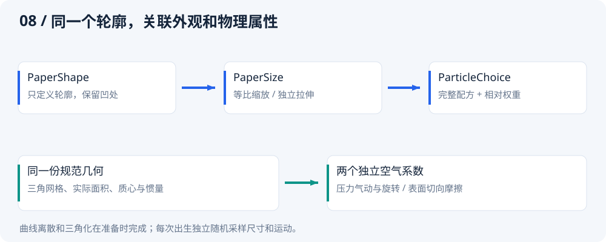

| 参数 | 默认值 | 作用 |
| --- | --- | --- |
| `shape` | `PaperShape.rectangle()` | 只描述局部平面轮廓；默认矩形，不包含颜色、速度或动画状态 |
| `size` | `PaperSize.stretched(width: NumberRange(.025,.055), height: NumberRange(.035,.075))` | 出生时采样米制尺寸，默认保留原矩形宽高独立随机分布 |

**形状构造与专属参数：**

| 构造 | 参数 / 默认 / 范围 | 行为 |
| --- | --- | --- |
| `PaperShape.rectangle()` | `aspectRatio: 1`，0.01–100，无量纲 | 宽/高；内置轻微圆角，无需配置，半径为规范轮廓短边的 20%。非等比尺寸会同时拉伸圆角；圆角参与实际材料面积和受力，共 20 个轮廓顶点 |
| `PaperShape.circle()` | 无 | 64 顶点近似圆；等比尺寸下各方向半径相同 |
| `PaperShape.triangle()` | 无 | 等边三角形，尖端朝局部 −Y；其他三角形使用 polygon |
| `PaperShape.star()` | `points: 5`，整数 3–32；`innerRadiusRatio: .45`，.05–.95 | 两个参数分别控制尖角数和内/外半径比；越小越尖细，轮廓为 2×points 个顶点 |
| `PaperShape.heart()` | 无 | 64 顶点近似心形，尖端朝局部 +Y；出生后会三维旋转 |
| `PaperShape.polygon(vertices: ...)` | 必填 List&lt;Offset&gt;；有效顶点 3–128 | 按给定顺序自动闭合，可重复末尾首点；复制数据，支持凹轮廓，顺逆时针均可 |
| `PaperShape.path(path, tolerance: .002)` | Path 必填；tolerance .0001–.01，无量纲 | 复制单个显式闭合轮廓，按最长边的相对采样偏差阈值离散；超 128 点拒绝，不能用 forceClosed 隐式修补输入 |

自定义坐标不代表米或像素：先以局部包围盒最长边归一化，再按实际面积质心居中；尺寸由 PaperSize 决定。输入坐标必须有限且绝对值不超过 1000000；归一化面积至少 0.00001，面积矩不能退化。相邻重复点、同向共线中间点会清理，反折、自交、自接触、空形状、孔洞、多块分离区域会报 ArgumentError。形状不会被静默替换成矩形或凸包。

内置形状支持 const，加入 ParticleChoice 时校验；自定义 polygon/path 在导入时校验。Path 测量只发生一次，修改原顶点列表或 Path 不影响已创建的形状。曲线近似阈值是局部几何量，不是屏幕像素；放大到很大时仍可能看到多边形边缘。

**推荐等比尺寸；需要主动变形时选择 stretched：**

```dart
// 圆保持圆形，心形和星形保持原比例；最长边为 3～6 cm。
const size = PaperSize.proportional(NumberRange(.03, .06));

// 宽高分别独立随机；用于旧矩形迁移或明确需要拉伸的轮廓。
const stretched = PaperSize.stretched(
  width: NumberRange(.03, .05),
  height: NumberRange(.05, .08),
);
```

两种构造都要求最终宽高在 0.002～0.5 m。proportional 的最小最长边乘以形状短长边比也必须 ≥0.002 m；极细形状不能通过很小尺寸进入不稳定状态。共享同一 PaperSize 不代表共享采样值：每个粒子独立抽样。旧纸片 width/height 应迁到 stretched，材料和发射数值按原值保留。

`PaperParticle.bend()` 显式启用长边单弧；`PaperParticle.noBend()` 保持平面，适合不需要弯曲的批量效果。必须选择 bend 或 noBend，不提供默认构造。它们共用 shape、size、面密度和气动；noBend 不接收弯曲参数。`bendEnabled` 表示所选模式。完整迁移与其余命名建议见 [API 命名审查](api-naming.md)。

| 柔性专属参数 | 默认值 | 单位 / 范围 | 作用 |
| --- | --- | --- | --- |
| `bendingStiffness` | `.00002` | N·m；1e−8–1 | 抵抗面外弯曲。越大越挺括；与 Ribbon 的 N·m² 不可直接换算 |
| `maximumBendRatio` | `.02` | 无量纲；0–.05 | 长边中点相对两端弦线的最大弓高 / 长边长度；默认最多2%，0完全使用刚性路径 |
| `damping` | `1.5` | s⁻¹；0–20 | 耗散内部形变率，控制回弹振荡，不额外衰减整体速度 |
| `flexible` | flexible 构造 true，其余为 false | 只读 | 由构造选择，不是可同时混填的模式参数 |


纸片只沿出生实际尺寸的长边形成一个轻微二次弧形，短边保持直线，正方形固定选择局部Y轴。局部受力、抗弯和内部阻尼驱动弧形，形变后的法线、位置和速度继续参与下一次气动。没有空气、没有初始旋转的均匀自由落体不会凭空弯曲。

完整二维薄片求解和 stretchingStiffness 已移除。每张纸片只新增一个弯曲自由度，与原有六个刚体速度共同求解7×7系统；外层仍120Hz、每步4～16子步。显示沿长边八等分，细分不增加物理自由度。详见 [长边轻弧、真实图像与性能](paper-bending.md)。

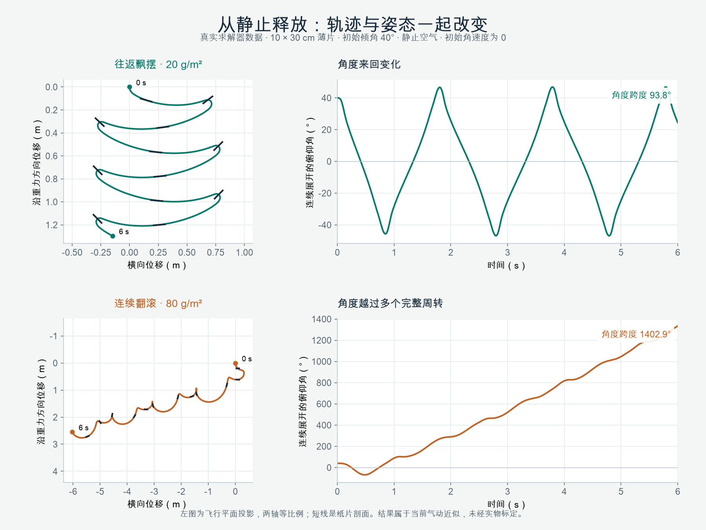

上图记录此前气动验收版本的刚性 `.noBend()` 对照求解器：两张 10 × 30 cm 纸片均从 40° 倾角、零初速和零初始角速度释放，静止空气、重力 9.81 m/s²；面密度分别为 .02 与 .08 kg/m²。这组条件下，前者往返飘摆、后者连续翻滚；不表示所有形状都遵循同样的密度规律；这是历史对照，当前圆角轮廓已有变化，不能保证复现同一翻滚次数。详见 [纸片气动、原始数据与观察方法](paper-aerodynamics.md)。示例新增“静止释放单张纸片”，可直接调节当前风场和两个空气系数观察响应。

这是参考薄片研究的三维实时近似，未经过实物材料标定；不求解完整尾流、附加质量、碰撞或塑性折痕。

凹轮廓的质心可以位于材料外部，材料点诊断取最近的有效材料点；该点包含旋转及弧形变化，不生成拖尾。

### 5.3 RibbonParticle 专属参数

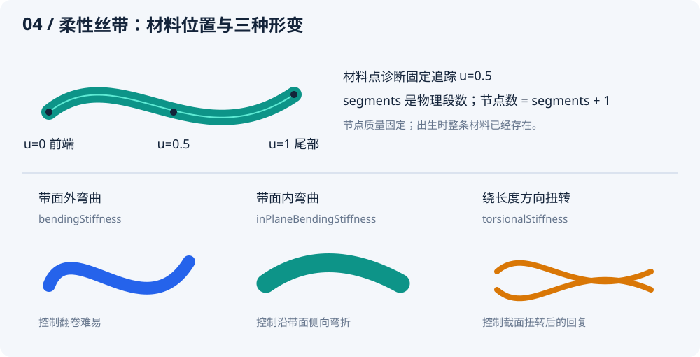

| 参数 | 默认值 | 单位 / 范围 | 作用与调节 |
| --- | --- | --- | --- |
| `width` | `.012–.024` | m；两端 .002–.5 | 彩带宽度，影响几何、面积和质量；纸片通过 size 配置尺寸 |
| `length` | `.35–.75` | m；两端 .04–3 | 完整材料长度。更长会更容易看到各段差异，也更易出画或交叠；同时改变面积、质量与求解的段长 |
| `segments` | `14` | 整数；4–32 | 长度方向物理分段，节点数是 segments+1。更多段提高形变分辨率并增加求解和绘制成本；不是“丝滑度百分比” |
| `bendingStiffness` | `.000002` | N·m²；1e−9–.001 | 带面外弯曲刚度。大时更抗翻卷，小时更柔软；极小值不能弥补时间步与空间分辨率的限制 |
| `inPlaneBendingStiffness` | `.0002` | N·m²；1e−9–1 | 带面内侧向弯曲刚度。通常比面外刚度大，表达薄带侧向弯折比翻卷更困难；两者不要求固定比例 |
| `torsionalStiffness` | `.000001` | N·m²；0–.01 | 相邻材料截面扭转后的回复刚度。越大越抗扭，0 去掉这一弹性回复项；不保证完全不转动 |
| `thickness` | `.00005` | m；1e−6–.001，且 ≤ 最小 width/10 | 参与截面绕长度轴的转动惯量。它不重新计算面密度，不直接改变总质量，也不会自动联动三个刚度 |
| `damping` | `1.5` | s⁻¹；0–20 | 内部应变率耗散，抑制弯扭振荡。大时形变回复更快耗散；不直接缩小整体平移或刚性旋转速度 |

丝带 `width` 和 `angularSpeed` 的默认值覆盖了共用基类的默认值，其他共用参数见上一表。

当前模型的节点质量固定在材料上，改变 segments 不增加总质量；世界质心由质量加权得到。两个端点在出生后自由运动，插件不会指定“始终由头端带着走”。材料中点诊断不影响节点质量或运动。

### 5.4 dragCoefficient 与 surfaceFriction 怎么选

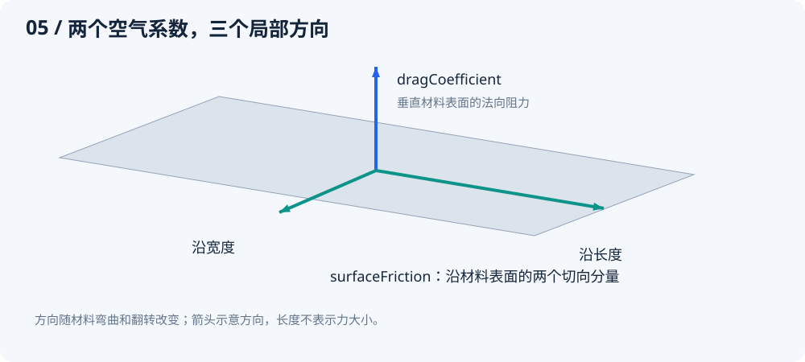

- **材料正面迎风**：法向分量较大，`dragCoefficient` 更直接影响受力。
- **沿材料表面滑过空气**：切向分量较大，`surfaceFriction` 更直接影响受力。
- **丝带已翻卷**：每段表面的三个轴都可能不同；不能把这两个参数固定对应到世界 X/Y/Z。

在沿长度方向发射的初段，提高 `surfaceFriction` 可能显著减少速度保持；中途带面转向迎风，`dragCoefficient` 的影响会变大。调整飞行距离时，结合姿态与质量观察，避免一次同时修改多个系数而失去对比依据。

### 5.5 为什么增加段数还可能显得弯折

物理节点定义材料离散程度，绘制使用共享切线的 Hermite 曲线，并按误差选择每物理段 1/2/4 级细分。增加物理段数与渲染细分不是同一件事；普通非退化接头的中心线保持 C1 连续，但不承诺曲率 C2 连续。

先关闭 `showNodes` 排除圆点干扰，再检查长宽比与刚度，最后逐步增加 `segments`。过窄的投影宽度、极端扭转、自交排序和细分上限也会影响观感。插件不提供碰撞、自碰撞、宽度方向褶皱或完整流体耦合，不能把这些效果通过某个参数“打开”。

<a id="wind"></a>
## 6. 风场与阵风

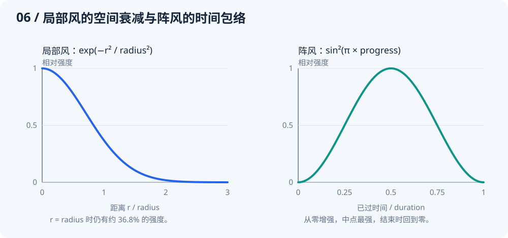

### 6.1 WindField：基础环境

| 参数 | 默认值 | 单位 / 范围 | 作用与调节 |
| --- | --- | --- | --- |
| `sources` | 空列表 | 最多 16 个 | 全局与局部风源可以混合，速度逐项相加；相反方向可能部分抵消 |
| `turbulence` | `0` | m/s；0–10 | 三维连续涡流的幅度系数。越大越容易形成变化气流；多个模式相加后的模长不以该值为硬上限 |
| `spatialScale` | `.8` | 1/m；.01–10 | 基础空间频率，内部叠加三个倍频模式。越大，邻近位置的气流方向变化越密集；并非风速大小 |
| `seed` | `1` | int | 涡流相位种子，与出生 seed 独立。没有涡流时它不会改变普通风源的时间相位 |

`sources: []` 且 `turbulence: 0` 表示**静止空气**，并不是没有空气阻力。`velocityAt(position, time)` 返回世界位置（m）和相对时间（Duration）上的基础空气速度（m/s）；它不包含模拟器后来添加的 WindGust 或 setWind 过渡。

### 6.2 WindSource.global / WindSource.local

| 参数 | 默认值 | 单位 / 范围 | 作用与调节 |
| --- | --- | --- | --- |
| `velocity` | 必填 | m/s；有限向量、模长 ≤10000 | 基础空气速度，可同时包含 XYZ 分量。不是对粒子的直接推力；零向量不会制造有方向的基础风 |
| `center` | local 必填 | m；有限向量、模长 ≤10000 | 局部衰减中心。global 不接受此参数，其只读属性为 null |
| `radius` | local 为 `2` | m；.01–1000 | 指数衰减尺度。距离 r 处乘 `exp(−r²/radius²)`；增大会扩大影响范围，但不存在半径外立即归零的边界 |
| `variation` | `.15` | 无量纲；0–.5 | 两个连续正弦分量的相对幅度。0 恒定强度；它改变风速强度，不让基础方向自行随机旋转 |
| `phase` | `0` | rad；−10000–10000 | 时间波动的相位偏移。不同相位能让多个风源的强弱错开，不改变基础方向 |

global 不接受 radius，内部只读值规范为 2，但不会用于空间衰减。恒定全局风要显式设 `variation: 0`。

以下公式中的 t 使用内部物理秒数，公开采样入口传 Duration。当前时间强度系数为 `1 + variation × [0.65 sin(0.43t + phase) + 0.35 sin(1.17t + phase + 2.1)]`。两个分量共同变化，phase 不是独立的“延迟秒数”。半径外的风仍然存在：r = radius 时约 36.8%，r = 2radius 时约 1.83%。

```dart
final wind = WindField(
  sources: [
    WindSource.global(
      velocity: const Vec3(.8, 0, .3),
      variation: .15,
      phase: 0,
    ),
    WindSource.local(
      velocity: const Vec3(0, -1.5, .5),
      center: const Vec3(0, 1, 0),
      radius: 1.2,
      variation: .2,
      phase: 1,
    ),
  ],
  turbulence: .25,
  spatialScale: .8,
  seed: 8,
);
controller.setWind(wind, transition: const Duration(milliseconds: 300));
```

这是一个全局右前方气流，加上画布下方附近的局部上升气流。局部中心是世界坐标，不会自动跟随某个粒子或组件。

### 6.3 WindGust.global / WindGust.local

| 参数 | 默认值 | 单位 / 范围 | 作用与调节 |
| --- | --- | --- | --- |
| `velocity` | 必填 | m/s；有限向量、模长 ≤10000 | 时间包络中点的峰值速度向量；局部阵风还乘空间衰减。不是整个过程一直使用这个强度 |
| `duration` | `Duration(seconds: 2)` | Duration；50 ms～30 s | 从弱到强再变弱的总时长。暂停模拟也暂停阵风；更长不是更大的峰值 |
| `center` | local 必填 | m；有限向量、模长 ≤10000 | 局部阵风的衰减中心；global 不接受，属性为 null |
| `radius` | local 为 `2` | m；.01–1000 | 与 WindSource.local 同样的指数衰减尺度；global 不接受，内部规范为 2 |

```dart
controller.gust(
  WindGust.local(
    velocity: const Vec3(2, -.5, 1),
    duration: const Duration(milliseconds: 1500),
    center: Vec3.zero,
    radius: 2,),
);
```

调用 `gust` 才会启动，单独构造一个 WindGust 不会生效。阵风叠加在当前基础风上，按 `sin²(π × 已过时间 / duration)` 平滑变化。最多同时保留 16 个，超出抛 `StateError`；结束自动移除。它不生成粒子，也没有粒子时不可见。

`controller.setWind(wind, transition: const Duration(milliseconds: 300))` 的 transition 使用 Duration，范围 0～5 秒；Duration.zero 立即切换。改变基础风不会清除正在活动的阵风。连续快速切换时，内部最多保留八个历史风场分量来衔接。

<a id="streak"></a>
## 7. 独立速度色带


### 7.1 StreakParticle

色带是独立粒子，通过已有 ConfettiEmitter 声明起点、方向、速度、数量和寿命。PaperParticle 和 RibbonParticle 不再附加拖尾。推荐同一 Effect 内用两个发射器组合短寿命色带与长寿命纸片；同一 particles 列表则复用所在发射器的寿命。

| 参数 | 默认 / 范围 / 单位 | 作用 |
| --- | --- | --- |
| `width` | NumberRange(.018, .03)；0.002–0.5 m | 头部实色宽度，出生时随机采样，随深度投影缩放 |
| `airResistance` | 1.5；0–60 s⁻¹ | 相对当地气流的线性阻尼率；0 仅受重力。它决定运动如何减速，不能从当前速度推导 |

```dart
const StreakParticle(
  width: NumberRange(.018, .03),
  airResistance: 1.5,
)
```

起点、方向、速度、数量和 `ParticleLifetime` 继续配置在 `ConfettiEmitter`；颜色和随机权重继续配置在 `ParticleChoice`。不再另配长度、模糊量或光迹展开收回时间。

### 7.2 长度与寿命自动配合

头部满足 `加速度 = gravity + airResistance × (当地风速 − 自身速度)`。风和重力在 XYZ 世界中改变真实点轨迹；色带沿当前速度向后拉伸。转弯时整条色带随方向旋转，不留下之前的弯曲历史，也不模拟材料形变。

内部视觉规则如下，均由每个粒子实际采样的寿命计算，不增加公开配置：

| 自动计算项 | 规则 |
| --- | --- |
| 拉伸时间尺度 | 寿命的 30%，最多 80 ms |
| 展开窗口 | 寿命的前 15%，最多 40 ms，平滑从零展开 |
| 收回窗口 | 寿命的最后 50%，最多 130 ms，平滑收回到零 |
| 世界长度 | `min(当前世界速率 × 拉伸时间尺度, 出生累计路程) × 展开包络 × 收回包络` |

同一寿命和年龄下，速度越快长度越长；减速时自动缩短。不再设置固定米制长度上限，网格规模仍有界。短寿命自动缩短三个窗口，长寿命也不会无限扩大拉伸时间。例如寿命 260 ms 时，拉伸时间尺度为 78 ms；包络完全展开且路程充足时，20 m/s 对应 1.56 m，40 m/s 对应 3.12 m。

主体前段近等宽且保持实色，最后约三分之一才明显收窄、透明。`lifetime.fadeIn/fadeOut` 只控制透明度，几何展开收回自动完成；所有退出过程包含在寿命内。即使速度不变，也会按寿命结束。生命周期按固定模拟步生效，没有额外历史存活阶段。

### 7.3 速度显隐与柔边自动计算

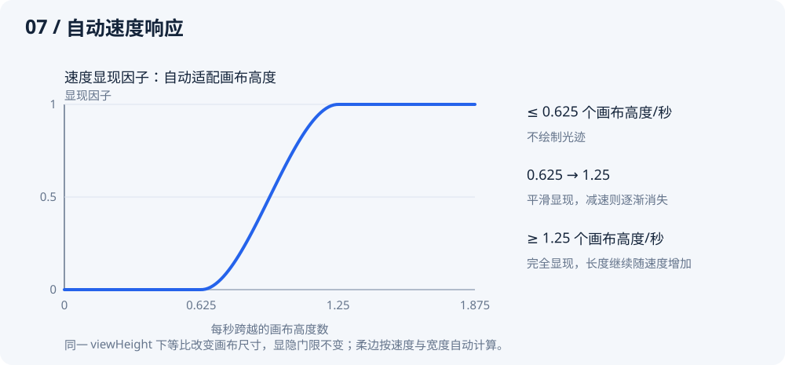

以 `投影速度 / 画布高度` 表示每秒跨越的画布高度数；使用完整 XYZ 透视投影导数，不使用每帧位移，也不包含相机移动速度。

- 不超过 0.625 个画布高度/秒时隐藏；从 0.625 到 1.25 平滑显现，达到 1.25 完全显现。例如画布高 800 逻辑像素时，对应 500～1000 逻辑像素/秒。
- 柔边随投影宽度和速度增加；内部计算为 `clamp(投影宽度 × .35 × 每秒画布高度数 / 1.25, .25, 4)` 逻辑像素，保留实色主干，不使用离屏模糊。
- 相同世界运动、相同 viewHeight 下，等比改变画布尺寸不改变显隐门限；改变 viewHeight 则会改变画面中相对运动速度。静止粒子不会因相机变化产生色带，纯沿视线且无横向投影速度的运动也不会产生色带。

这些是内置视觉风格规则，不是纸片材料定律。相机只影响投影后的显隐和柔边，不改变点运动、寿命或世界长度。快照的 `streakLength` 是未应用投影可见门限的世界长度。

### 7.4 从旧参数迁移

删除粒子上的 `trail` 和 `trailMaterialPosition`，删除 TrailStyle、trailSamples 预算及历史读取。新增单独的 StreakParticle 发射器；颜色仍由 ParticleChoice.colors 提供，随机选择沿用 weight。

早期 StreakParticle 的 `stretchDuration`、`maximumLength`、`expandDuration`、`shrinkDuration`、`fullSpeed`、`maximumBlur` 也已删除，无需填写替代参数。已有发射器的 speed、origin、direction、lifetime 和风场继续生效；使用 `width` 调整粗细、`airResistance` 调整减速响应。诊断使用 `stats.streakParticles`、`painter.stats.streaks` 和 `snapshot.streakLength`。

<a id="camera"></a>
## 8. 相机与坐标转换

| 参数 | 默认值 | 单位 / 范围 | 作用与调节 |
| --- | --- | --- | --- |
| `viewHeight` | `8` | m；.1–1000 | Z=0 平面可见的世界高度。越小越放大，粒子与轨迹在屏幕上更大，但没有改变实际飞行 |
| `distance` | `10` | m；.1–1000 | 相机位于 `(0,0,distance)`，朝原点观察。改变它会改变不同 Z 平面的透视比例；在 Z=0 上比例保持由 viewHeight 决定 |
| `near` | `.25` | m；.01–distance | 距相机的近裁剪距离。太近的几何被裁掉，避免透视放大到无穷 |
| `far` | `60` | m；distance+.01–10000 | 距相机的远裁剪距离。太远的几何不可见；不是粒子运动边界 |

相机始终沿 Z 轴观察，不提供自由旋转相机或任意 lookAt。世界原点投影到视口中心；Z=0 的可见宽度由 `viewHeight × viewport.width / viewport.height` 决定。

| 方法/参数 | 输入与返回 | 注意点 |
| --- | --- | --- |
| `project(position, viewport)` | 世界位置 m、视口逻辑尺寸 → `Offset?` | 位置非有限、视口空或超近远裁剪返回 null；不按左右上下画布边界裁剪，坐标可能在画布外 |
| `unproject(position, viewport, depth: 0)` | 视口局部逻辑像素、视口尺寸、世界 Z 平面 → Vec3 | depth 是世界 Z，不是距相机的距离；必须处于相机裁剪范围内，非法输入抛 ArgumentError |

投影关系是：`depthToCamera = distance − z`，`scale = viewport.height/viewHeight × distance/depthToCamera`，像素位置等于画布中心加 `(x,y) × scale`。通常只需调用 API，不要复制一套业务投影公式。

按钮点击坐标经常来自全局屏幕；应先转换到真正绘制区域：

```dart
final overlayBox = Overlay.of(context).context.findRenderObject()! as RenderBox;
final local = overlayBox.globalToLocal(globalTapPosition);
final origin = camera.unproject(local, overlayBox.size, depth: 0);
// Confetti.launch 必须传入这个 camera。
```

自定义 ConfettiView 也要使用其所在绘制区域的 RenderBox。不要混用 SafeArea 外的屏幕尺寸与组件内部的 localPosition。

<a id="host"></a>
## 9. 宿主、播放控制与生命周期

### 9.1 构造与入口参数

| 入口 | 参数及默认 | 作用 |
| --- | --- | --- |
| `Confetti.launch` | `context` 必填 | 查找最近的、已经完成非空布局的 Overlay；不是任意页面 BuildContext 都能在构建前立即发射 |
| 同上 | `effect` 必填 | 本次要播放的配方；同一 Overlay 新请求替换旧请求 |
| 同上 | `camera: ConfettiCamera()` | 覆盖层投影相机，必须与反投影一致 |
| 同上 | `gravity: Vec3(0,9.81,0)` | 世界加速度 m/s²；有限向量、模长 ≤10000，零向量关闭重力 |
| 同上 | `wind: null` | 初始基础风场；null 表示静止空气 |
| 同上 | `limits: ConfettiLimits()` | 这次临时控制器的资源上限 |
| 同上 | `respectReducedMotion: true` | 尊重 `MediaQuery.disableAnimations`；生效时返回已结束句柄 |
| `ConfettiController` | `gravity / wind / limits` | 默认值与上面相同；多个 emit 共享该控制器的风、时钟和预算 |
| `ConfettiView` | `key` | Flutter 组件身份键；不参与随机种子或发射身份 |
| 同上 | `controller` 必填 | 同一时间只能绑定一个视图；调用方负责 dispose |
| 同上 | `camera: ConfettiCamera()` | 将世界映射到当前 View 的绘制区域 |
| 同上 | `showNodes: false` | 显示真实物理节点的调试圆点；不改变求解，也不是丝带装饰 |
| 同上 | `respectReducedMotion: true` | 减少动画生效时清除现有播放并抑制新请求 |
| 同上 | `child: null` | 本体下方的内容；整个 View（包括 child）忽略触摸；父级需给有限宽高 |

`ConfettiView` 使用自己的 Ticker：后台或 TickerMode 禁用时暂停，恢复后不补算暂停时长；主动暂停同样保留粒子。每帧最多补算 0.1 s，物理步长固定为 1/120 s。View 卸载会清空播放，但不会代替创建者销毁 controller。

### 9.2 控制器与播放句柄

| 对象 / 方法或属性 | 影响范围 | 行为 |
| --- | --- | --- |
| `controller.emit(effect)` | 新的一次播放 | 返回 ConfettiPlayback；未绑定视图时没有自动时钟；达到并行上限抛 StateError |
| `controller.pause() / resume()` | 整个控制器 | 暂停/恢复 View 时钟，不阻止外部误调用 simulation.advance |
| `controller.isPaused` | 控制器状态 | 只反映主动 pause，不涵盖后台等自动原因 |
| `controller.isIdle` | 模拟工作 | 没有待发射效果、保留粒子或活动阵风时 true；恒定基础风不使它保持忙碌 |
| `controller.clear()` | 整个控制器 | 取消播放、清除粒子/阵风；保留模拟时间、基础风和累计计数 |
| `controller.setWind(wind, transition: const Duration(milliseconds: 300))` | 全部已有/未来粒子 | 0–5 模拟秒过渡；风场不是按每个 playback 隔离 |
| `controller.gust(gust)` | 全部受影响位置 | 添加有限时间阵风；减少动态效果生效时忽略 |
| `controller.stats / simulation` | 诊断/高级操作 | stats 不复制几何；simulation 由 controller 拥有，不应再用另一个时钟推进 |
| `controller.dispose()` | 整个控制器 | 清空并释放，可重复调用；销毁后不应再调用控制方法 |
| `playback.stopEmission()` | 仅这次 emit | 停止待出生项，包括尚未到期的 burst；已有粒子自然结束 |
| `playback.cancel()` | 仅这次 emit | 立即移除其粒子，不取消其他播放 |
| `playback.done / isComplete` | 仅这次 emit | Future 返回 completed 或 cancelled；不把粒子离开视口当作提前完成 |

控制器受减少动画抑制时，`emit` 返回已取消句柄，原因是 `ConfettiCompletion.cancelled`；Overlay 入口有更细的 `reducedMotion` 原因，两种枚举不要混用。

### 9.3 Overlay 播放句柄

| 方法/属性 | 说明 |
| --- | --- |
| `pause() / resume()` | 只控制本次 Overlay 请求；仍遵守宿主生命周期 |
| `stopEmission()` | 停止后续出生，让已有粒子自然结束 |
| `finish()` | 立即结束并清理，done 返回 completed |
| `cancel()` | 立即结束并清理，done 返回 cancelled |
| `status` | `playing / paused / completed`；最后一个表示已终止，不等于只包含正常完成 |
| `isComplete` | 任意终止原因发生后为 true |
| `done` | 返回 `completed / cancelled / replaced / hostDisposed / reducedMotion` 之一 |

`completed` 可能是自然结束，也可能是 `finish()`。`replaced` 表示同一 Overlay 的后一次请求替代当前请求；`hostDisposed` 表示宿主卸载。句柄结束后再调用操作不会影响后续请求。

Overlay 句柄不暴露 `setWind/gust`。需要实时风控制时，用 Controller/View 接入；不要试图访问私有 session。

### 9.4 离线模拟与独立绘制

| API / 参数 | 作用与约束 |
| --- | --- |
| `ConfettiSimulation(gravity, wind, limits)` | 与 Controller 同样的环境默认值；调用者管理时钟和 dispose |
| `ConfettiSimulation.stepsPerSecond` | 固定物理频率 120 Hz，只读常量；不是时长 |
| `simulation.advance(elapsed)` | 输入 Duration，范围 Duration.zero～60 s；余下不足一步的微秒保留到下次，不自动重绘 |
| `simulation.time` | Duration：完整物理步时刻舍入到最近微秒，不含输入余量；clear 保留完整步时钟 |
| `simulation.gravity = Vec3(...)` | 实时修改后续物理步重力；同样进行有限性/模长校验 |
| `emit / setWind / gust / clear / dispose` | 与上表的作用范围一致；simulation.clear 不重置时间或累计统计 |
| `simulation.isIdle / stats / snapshot` | 工作状态、轻量统计、按需复制的诊断快照 |
| `ConfettiPainter(simulation: ...)` | 必填真实模拟器；绘制器只读状态，不推进物理 |
| `camera: ConfettiCamera()` | 投影参数；构造 Painter 时校验 |
| `showNodes: false` | 节点调试标记，开启会看到圆点 |
| `repaint: Listenable?` | 可传 controller 请求重绘；只是绘制通知，不是第二套时钟 |
| `paint(canvas, size)` | 绘制到画布并裁剪到逻辑尺寸；空尺寸只清空绘制统计 |
| `painter.stats` | 最近一次绘制的统计；不是 GPU 时间或内存测量 |

Duration 支持整数微秒，但 1/120 秒不是整数微秒。内部以输入微秒 × 120 累计，每达到 1000000 执行一步；不要把单步当成固定的 8 ms 或反复累加 8333 μs。真实 Ticker 应传相邻回调 Duration 的差值。离线采样例如：

```dart
var previous = Duration.zero;
const fps = 24;
for (var frame = 0; frame <= 120; frame++) {
  final elapsed = Duration(
    microseconds: (frame * Duration.microsecondsPerSecond + fps - 1) ~/ fps,
  );
  simulation.advance(elapsed - previous);
  previous = elapsed;
  // 此时再绘制或读取快照。
}
```

不要用每次“目标时间减 simulation.time”的方式替代输入时间记录：time 不含不足一步的余量，且对外舍入到微秒。`clear()` 会将不足一步的余量清零，但保留已完成步的时钟。

不要同时让 ConfettiView 和外部定时器推进同一个 simulation，否则动画会被重复计算。普通 UI 接入无需读取每帧 snapshot 或直接调用 paint。

<a id="diagnostics"></a>
## 10. 资源预算、统计与排错

### 10.1 ConfettiLimits

| 参数 | 默认 | 范围 | 含义与取舍 |
| --- | --- | --- | --- |
| `particles` | 400 | 1–2000 | 同时保留的寿命内粒子数，三种粒子共享；不是每次 emit 独占数量 |
| `paperTriangles` | 4096 | 0–64000 | 同时保留纸片的规范绘制三角形总数；每张受力点最多3(T+2)，单弧显示最多24T面；单弧只增加一个物理自由度；0 拒绝纸片，不改变轮廓精度 |
| `ribbonSegments` | 840 | 0–12000 | 同时保留的彩带物理分段总量；0 会拒绝所有彩带，增加它不提升单条丝带精度 |
| `playbacks` | 32 | 1–128 | 尚未结束的并行效果上限；超出 emit 抛 StateError，不是静默替换 |
| `birthAttemptsPerStep` | 512 | 1–10000 | 一个 1/120 秒边界共享的出生尝试上限。多次 emit 与持续出生共用，clear 不恢复当前步额度 |

预算不足的出生直接丢弃、计入统计，**不在后续补发**。将预算加大只是允许更多工作，不是性能优化；需要结合目标设备测量。

容量计算例子：

- 5 条 × 18 段丝带，占用 90 个物理分段额度。
- 内置圆角矩形 18 个规范绘制三角形、默认五角星 8 个、圆/心形各 62 个；50 个圆预留 3100 个纸片三角形，对应 9600 个受力采样点。
- 纸片几何由相同配方共享，但预算按每个保留粒子的运行工作量计数；清理粒子后释放额度。
- StreakParticle 只占粒子额度，不占纸片三角形或彩带物理段数；每条固定生成 35 个世界四边形，裁剪前最多 70 个三角形，寿命结束即回收。

### 10.2 ConfettiStats：观察资源和拒绝原因

| 字段 | 含义 |
| --- | --- |
| `particles` | 当前保留总数，只包含寿命内粒子 |
| `streakParticles` | 当前独立光迹数，包含低速暂不可见的光迹 |
| `livingParticles` | 当前仍参与物理模拟的粒子数 |
| `paperTriangles` | 当前保留纸片的规范绘制三角形数；它不是受力采样点计数 |
| `ribbonSegments` | 当前保留彩带的物理分段总数 |
| `playbacks` | 待生成或尚有粒子的效果数 |
| `droppedParticles` | 累计容量拒绝 + 工作额度拒绝 + 非有限运动状态清理 |
| `capacityRejections` | 累计粒子/丝带分段/纸片三角形容量不足导致的拒绝 |
| `workLimitRejections` | 累计当前物理步出生尝试额度不足导致的拒绝 |
| `invalidParticles` | 累计数值异常清理；正常配方不应依赖它回收粒子 |
| `birthAttempts` | 累计实际进入候选生成的次数；不包含循环外批量拒绝 |

累计计数从模拟器创建开始，clear 不重置。排查一次播放可以记录前后差值，或创建新的模拟器。

### 10.3 ConfettiRenderStats：观察绘制工作

| 字段 | 含义 |
| --- | --- |
| `drawCalls` | 这次 Canvas.drawVertices 的提交次数，非底层 GPU 指令数 |
| `vertices` | 跨批次提交的顶点总数，重复提交也重复计数 |
| `triangles` | 网格三角形数量 |
| `visibleParticles` | 材料或光迹贡献了可提交三角形的粒子数；不判断是否被其他粒子遮挡，也不等于屏幕像素计数 |
| `streaks` | 通过速度门限并生成世界几何的光迹数，尚未判断屏幕包围盒是否可见 |
| `ribbonSegments` | 绘制彩带小段数，不是物理节点/分段预算 |
| `refinementLimited` | 达到四等分上限后仍超误差或跨裁剪面的段数，用于观察近似精度压力 |

这些统计不包括 showNodes 的调试圆点，也没有直接提供帧耗时；测量性能仍需要真实的 profile。

### 10.4 ParticleSnapshot：按需诊断

| 字段 | 单位 / 含义 |
| --- | --- |
| `id` | 当前模拟器的粒子编号，不保证连续 |
| `particle` | 原始配方，包含随机范围；不是该粒子的所有已采样数值 |
| `position / velocity` | m / m/s；纸片中心、丝带质量加权质心或光迹头部 |
| `width / mass / area` | 已采样宽度 m / 总质量 kg / 实际材料面积 m² |
| `materialPosition / materialVelocity` | 固定材料点的世界位置 m / 实际速度 m/s；彩带固定取材料中点；凹形纸片取可能偏离质心的有效材料点 |
| `age / lifetime` | Duration；age 从出生起累计，到寿命结束即回收 |
| `alive` | 是否处于寿命内；已回收粒子不出现在新快照中 |
| `nodes` | 世界位置列表 m；丝带从前到尾共 segments+1 个，纸片为按轮廓顺序排列的全部世界顶点 |
| `widthDirections` | 单位方向；丝带每段一个，纸片一个宽度轴 |
| `kineticEnergy / elasticEnergy` | J；材料粒子均提供动能，刚性纸片的弹性能为 0 |
| `streakLength` | 光迹世界长度（米），尚未应用速度门限；其他粒子为 null |
| `bendRatio` | 纸片有符号弓高 / 长边长度，刚性为0，彩带为null |
| `surfaceVertices / surfaceTriangles` | 纸片显示网格，米制顶点与三角形索引；丝带为空 |
| `angularVelocity` | rad/s；纸片整体世界角速度，不包含内部弧形速度；丝带各截面不同，为 null |
| `angularMomentum` | kg·m²/s；粒子关于世界原点的总角动量 |

光迹的 `mass`、`area`、材料点、动能、弹性能和角动量为 null；它的 `nodes`、`widthDirections` 和纸片表面网格为空。

每次读取 snapshot 都复制数据，适合按需诊断，不适合逐帧重建 UI。它是不可变快照，不是通过写字段控制粒子的入口。

### 10.5 按症状调节

| 现象 | 先检查 | 再考虑的调节 |
| --- | --- | --- |
| 发射距离短 | viewHeight、画布尺寸、初速度、实际姿态与空气系数 | 确认是物理距离还是屏幕比例；提高 speed，或针对法向/切向分别减小空气系数；面密度也会改变空气响应 |
| 没有光迹 | 是否有独立 StreakParticle 发射器、投影速度、年龄、颜色 alpha | 观察每秒跨越的画布高度，增加发射速度或检查寿命、alpha |
| 光迹太长/太亮 | 发射 speed、颜色 alpha、lifetime.fadeOut | 长度随速度自动调整；降低发射速度缩短色带，调低颜色透明度或调整淡出控制亮度 |
| 风设置了但不明显 | 是否有存活粒子、局部距离、风与材料的相对速度、空气系数 | 增大正确方向的 velocity，调整 center/radius；radius 外不是零，但可能已经很弱 |
| 丝带像圆点 | showNodes 是否开启；宽度是否只投影到一两个像素 | 关闭调试标记；合理增加 width 或相机放大 |
| 丝带僵直/折线感 | 三种刚度、实际长宽比、物理段数、投影精度 | 分别调整形变刚度；适度增加 segments；查看 refinementLimited |
| 数量少于配置 | capacityRejections、workLimitRejections、stream 的逐发射器取整 | 减少同边界出生数量、错开发射或合理调整对应预算 |
| 重播同种子不同 | clear 是否保留旧时钟，风场/阵风/预算是否一致 | 新建控制器并恢复初始环境；不拿不同 SDK/源码版本作逐帧等同承诺 |
| 动画突然停止 | 寿命、裁剪、后台、TickerMode、减少动画、Overlay 替换 | 查看句柄 done 原因；区分离开视口与播放真正结束 |
| 卡顿 | 同屏丝带数 × 段数、光迹数量、snapshot 读取频率 | 先减数量/物理段数，减少不需要的独立色带；按目标设备 profile 验证 |

当前纸片和彩带求解较早期版本成本更高；默认上限不是 60/120 Hz 保证。此前纸片气动版本的桌面 CPU 测量中，64 张矩形物理步进 p95 为 1.14 ms，64 张圆形为 7.48 ms，且未包含 GPU/屏幕呈现成本，详见 [迁入记录](history.md)中的纸片气动历史验收位置。材质没有实物标定，透明自交依赖近似深度排序，既不模拟碰撞也不模拟尾流/遮风；这些是当前能力边界，不由文档中的预设改变。

<a id="evidence"></a>
## 11. 复现素材与验证范围

### 11.1 文件对应关系

| 文件 | 用途 |
| --- | --- |
| `presets.dart` | 六个完整静态配方方法与实际拍摄环境；画廊和素材导出共用 |
| `gallery.dart` | 可在 Flutter 中运行的六场景交互页面 |
| `quick_start.dart` | 最小 Overlay 接入示例 |
| `guide.template.md` | 本文编辑源；完整配置代码从 Dart 源码插入，避免手抄漂移 |
| `guide.md / guide.html` | 生成后的 Markdown 与离线可阅读 HTML |
| 六组预设的 `assets/*.png / *.mp4` | 当前 Flutter 引擎真实渲染的截图与动画 |
| `assets/*.svg` | 八张参数原理图；实际求解器时间序列绘制的 paper-flight 轨迹图使用 PNG |
| `paper-bending.md` | 柔性材料参数、局部受力、真实弯曲图和限制 |
| `paper-aerodynamics.md` | 纸片受力、参数联动、研究依据与模型边界 |
| `assets/paper-flight.json` | 此前气动验收版本零初速释放六秒的实际轨迹与姿态数据；未用当前圆角轮廓重新录制 |
| `../tool/record_paper_flight_test.dart` / `../tool/plot_paper_flight.py` | 捕获实际飞行并绘图；绘图使用 Matplotlib 与中文字体 |
| `assets/capture.json` | 实际导出帧数、种子、资源峰值与拒绝/异常计数 |
| `../tool/render_guide_test.dart` | 通过真实 Flutter 引擎导出并验证六组配方 |
| `../tool/build_guide_figures.py` | 生成八张参数原理图 |
| `../tool/build_guide.mjs` | 组装图文文档、视频与配方代码 |

### 11.2 重新生成

从 `packages/spatial_confetti` 执行，Flutter 依赖应已解析；素材编码需要本机 ffmpeg。原理图脚本使用 Python 3，真实截图拼版另需 Pillow 和中文字体；macOS 默认使用系统黑体，其他环境通过 `GUIDE_FONT` 指向已安装的中文字体文件。构建文档前在 `tool/` 运行 `pnpm install --frozen-lockfile`，安装固定的 `marked` 版本；也可通过 `MARKED_MODULE` 指定已有模块路径。该依赖仅用于文档生成，不属于 Flutter 运行时依赖。

```bash
flutter test --no-pub tool/render_guide_test.dart
python3 tool/build_guide_figures.py
node tool/build_guide.mjs
```

导出器使用固定 1/120 s 物理步，按 24 fps 采样图片；之后用同一帧序列编码视频。各组都检查无数值异常、无预算丢弃并最终正常完成，高速预设还检查了真实光迹几何产生。

验证只覆盖这份文档新增配方与示例，不重新执行全仓或完整 App 测试。真实离线渲染证明示例使用当前可执行实现；它不能替代真机 GPU/帧耗时测量，也不能证明材料已经达到实物一致性。

上一轮独立光迹迁移已验证插件、交互示例和 App 彩纸配置。该轮插件测试合计 86/87 通过；剩余零初速纸片翻滚测试在修改前副本中同样失败，没有调整物理模型或降低断言。本轮速度参数精简仅运行光迹/时间测试 16 项、App 配方与绘制 2 项、示例光迹 1 项、色带导出 1 项，全部通过；静态分析通过，其他包测试未重跑。具体范围见[迁入记录](history.md)中的独立光迹历史验证位置。

| 预设 | 导出帧数 | 峰值保留粒子 | 容量/工作丢弃 | 数值异常 | 结束状态 |
| --- | --- | --- | --- | --- | --- |
| 轻量庆祝 | 97 | 52 | 0 | 0 | completed |
| 双侧礼炮 | 109 | 120 | 0 | 0 | completed |
| 纸片雨 | 121 | 102 | 0 | 0 | completed |
| 长丝带飘舞 | 121 | 5 | 0 | 0 | completed |
| 开场速度色带 | 97 | 35 | 0 | 0 | completed |
| 多形状随机混合 | 121 | 56 | 0 | 0 | completed |

源码索引：[纸片形状与尺寸](../lib/src/paper_shape.dart) · [纸片几何](../lib/src/paper_geometry.dart) · [纸片受力](../lib/src/paper_dynamics.dart) · [配置](../lib/src/config.dart) · [风场](../lib/src/wind.dart) · [时间类型](../lib/src/time.dart) · [坐标与相机](../lib/src/vector.dart) · [宿主](../lib/src/host.dart) · [Overlay](../lib/src/overlay.dart) · [模拟器](../lib/src/simulation.dart) · [彩带气动力](../lib/src/ribbon_dynamics.dart) · [绘制器](../lib/src/painter.dart)。
