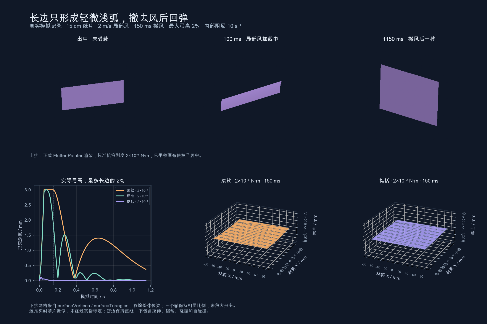

# PaperParticle 的长边轻弧

`PaperParticle.bend(...)` 现在只沿实际长边微微弯曲，形成一条连续的浅弧，短边保持直线。`PaperParticle.noBend()` 保持平面，不提供默认构造器。完整二维薄片、拉伸、剪切和局部折叠求解已移除。



图中为 15 × 15 cm 纸片；尺寸相等时固定沿局部 Y 轴弯曲。零初速、零初始转速、无重力，在一角施加 2 m/s 局部风，半径 .055 m，150 ms 时撤去风源。最大弓高为长边的 2%，即 **3 mm**。曲线、曲面与图像来自真实模拟及正式 Painter，未放大形变。

[原始数据](assets/paper-bending.json) · [Flutter 捕获工具](../tool/record_paper_bending_test.dart) · [绘图工具](../tool/plot_paper_bending.py)

## 使用

```dart
const paper = PaperParticle.bend(
  shape: PaperShape.rectangle(),
  size: PaperSize.stretched(
    width: NumberRange(.03, .04),
    height: NumberRange(.05, .07),
  ),
  bendingStiffness: .00002,
  maximumBendRatio: .02,
  damping: 1.5,
  dragCoefficient: 1.15,
  surfaceFriction: .02,
);
```

将配方放入原有 `ParticleChoice` 即可；发射器、形状随机混合、XYZ 风、寿命淡入淡出均沿用现有接口。若只想更轻微的弧形，将 `maximumBendRatio` 调为 `.01`（最多 1%）。

## 参数

| 参数 | 默认值 | 单位 / 范围 | 作用 |
| --- | --- | --- | --- |
| `bendingStiffness` | `.00002` | N·m；1e−8～1 | 抵抗长边弯曲。相同载荷下越大越挺括；小载荷可能达不到幅度上限 |
| `maximumBendRatio` | `.02` | 无量纲；0～.05 | 长边中点相对两端弦线的最大弓高除以长边长度。0 使用与刚性完全相同的飞行路径，.02 表示最多2% |
| `damping` | `1.5` | s⁻¹；0～20 | 控制弧形回弹速度的衰减，不额外衰减整体平移和旋转；0 关闭内部阻尼，空气与数值积分仍有耗散 |
| `massPerArea` | `.08` | kg/m²；.005～5 | 面积乘面密度得到质量，也参与弯曲模态质量和回弹速度 |
| `dragCoefficient` | `1.15` | 无量纲；0～4 | 缩放法向压力、攻角压力分布和旋转气动；差异载荷可以驱动弧形 |
| `surfaceFriction` | `.02` | 无量纲；0～1 | 独立控制沿当前弧面的空气摩擦，也参与整体与弯曲响应 |

弓高上限是为了保持“微微弯曲”的外观约束，不是纸张材料常数。达到边界时吸收继续向外弯曲的速度，风改变后仍能朝相反方向回弹。纸面抗弯刚度的单位为 N·m，不能直接照搬 Ribbon 的 N·m² 数值。

`stretchingStiffness` 已移除：该模型没有面内拉伸自由度，保留这个参数会造成误导。时间配置仍使用 Duration，阻尼是速率，因此为 double。

## 受力与形变

出生时按实际宽高选择长边，宽大于高则沿 X，高大于或等于宽则沿 Y。选择之后不会因屏幕投影或翻转而改变弯曲轴。

每张纸片只有一个弓高状态及其速度。局部风作用在实际材料点上；将受力投影到这个二次弧形模式，得到弯曲驱动力，再结合抗弯弹性和阻尼推进。变形后的位置、法线和材料速度继续参与下一次法向压力与切向摩擦。压力中心及平均攻角沿用现有气动近似。

弧形函数去除了面积平均和平面倾斜分量，避免把同一载荷重复计算成整体移动与弯曲。均匀重力使自由纸片整体下落；没有空气、没有初始旋转时不会凭空产生弯曲。风撤去后由弹性推动回弹。

这是一种小斜率单模态近似，专门表达轻微浅弧。长边弧长与原平面长度存在二阶小量差异，不声称精确不可伸长。没有预设正弦摆动，也不模拟短边卷曲、褶皱、折痕、撕裂、碰撞、自碰撞或完整流体，参数未经过实物标定。

## 绘制与材料诊断

显示沿长边八等分，法线直接来自解析弧面。凸轮廓直接切成条带；凹轮廓在已校验的材料三角形内裁切，保留缺口。这些显示顶点不增加物理自由度。

材料诊断点使用解析材料坐标，速度包含整体平移、旋转和弧形变化，不生成拖尾。`nodes` 保持原有轮廓顶点语义，`surfaceVertices / surfaceTriangles` 是显示网格，`elasticEnergy` 为单弧弹性能。新增 `bendRatio` 记录有符号弓高比例：刚性为0，彩带为null。

规范轮廓有 T 个三角形时，两种纸片的受力点均最多3(T+2)，单弧显示最多24T个面，实际通常更少。镜头和设备速度不改变这个定义。

## 成本

本机 macOS / Flutter test（JIT），64张纸片、无拖尾；每次推进一个1/120秒物理步，预热24步后记录120步。CPU数据如下，不包含 GPU 或屏幕呈现。

| 模式 | 物理 p50 / p95 | 绘制提交 p50 / p95 |
| --- | --- | --- |
| 刚性矩形 | .684 / .974 ms | .131 / .314 ms |
| 长边轻弧矩形 | 1.093 / 1.474 ms | .831 / 1.100 ms |
| 刚性圆形 | 5.558 / 5.917 ms | 2.850 / 3.293 ms |
| 长边轻弧圆形 | 11.321 / 11.985 ms | 3.748 / 4.280 ms |

上一版完整薄片的64张圆片物理 p50 为111.104ms，本版为11.321ms，减少约90%。不过60Hz显示帧通常需要两个物理步，复杂形状批量仍须控制数量；本轮没有进行真机 profile，不能将本机数字承诺为手机帧率。

[原始成本数据](assets/paper-bending-cost.json) · [测量工具](../tool/benchmark_paper_bending_test.dart)

## 示例

在 example 中关闭“纸片不弯曲”，点击“静止释放单张纸片”，用“长边最大弓高”调整0～5%的范围，结合抗弯预设、内部阻尼与 XYZ 风观察轻弧。参数作用于下一次出生的纸片。
